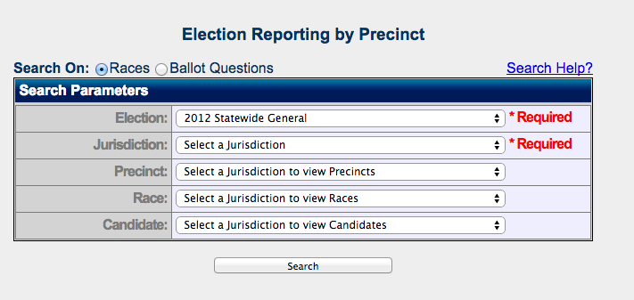

Finding precinct-level election results from Nevada isn't the problem. Getting them is the problem.

If you've been writing scrapers long enough, chances are you've come across what could be fairly called "the form from hell." It usually is found on a URL that ends .aspx and features paginated links that have a JavaScript link that performs a postback request to the server. In other words, not something that you can just iterate over using a unique ID for every record.

That's the kind of site the Nevada Secretary of State has for its [database of precinct-level election results](http://www.nvsos.gov/electionresults/PrecinctReport.aspx), and this is how I got them for OpenElections. The story goes through some of the usual stages: denial, annoyance and finally acceptance. It ends with a clean copy of every precinct-level result from 2004 through 2012, and I'm hoping the state adds 2014 results soon.

### Denial



"This isn't a problem," I told myself after I first found the site. The form itself is consistent over time and the form options (elections, jurisdictions, races, candidates) are logical. Each of the results links has a unique postback link. All I needed was a way to parse them and then execute that JavaScript. The parsing part was pretty easy: Python's popular [Beautiful Soup library](http://www.crummy.com/software/BeautifulSoup/) parses HTML very well, and this was the only form on the page.

The form allows you to search by election, jurisdiction, race, candidate and even by precinct. For example, here are [results for the 2nd Congressional District race in 2012 in Storey County](http://www.nvsos.gov/electionresults/PrecinctReportResults.aspx?e=17&a=18&t=4&c=0&p=0&m=r&election=2012+Statewide+General&agency=Storey&precinct=&contest=U.S.+Representative+in+Congress%2c+District+2&candidate=). That URL gave me hope: it seemed as if there was a way to construct permanent URLs for each set of results. The trouble was in the pagination - since that's a postback, the URL doesn't change when you click on each page's link. So scraping the form's results wasn't going to be simply a matter of looping through each jurisdiction and then building out the proper URLs. Not that I didn't try that approach first.

### Annoyance

Using Beautiful Soup and Python's [requests library](http://docs.python-requests.org/en/latest/), it was trivial to retrieve the URLs for the initial form results and parse the HTML. But executing the JavaScript links was another matter - I always ended up with the same results. Time to try something different. On Twitter, I [asked for some advice](https://twitter.com/derekwillis/status/549981570149654528), and the common denominator was using some kind of headless browser to mimic an actual user bringing up results and clicking on the links. Tom Lee, formerly of Sunlight Labs and now at MapBox, provided [one example](https://github.com/sbma44/yahoofantasyfootball/blob/master/yahoofantasyfootball/__init__.py) using [Selenium](http://selenium-python.readthedocs.org/en/latest/index.html) and [PhantomJS](http://phantomjs.org/).

Although a lot of what Selenium gets used for are things such as performing integration tests on web applications - checking that the right things happen when users click on links, for example - the good news is that my use case isn't all that uncommon. Some web sites are easier to navigate than to scrape. But this was my first time using Selenium, and I ran into some interesting problems along the way.

The basic concept isn't difficult: you use a library like Selenium to start up a browser (in my case I used Firefox), like so:

```python
from selenium import webdriver
driver = webdriver.Firefox()
driver.get('http://www.nvsos.gov/electionresults/PrecinctReport.aspx')
```

That will open up the browser and load the precinct form. So far, so good. Most of the issues I encountered dealt with the form itself. After selecting one of the options - say, picking a jurisdiction - the rest of the form would update itself automatically. I could see that when clicking on links, but when I automated it using Selenium, I found it necessary to add in a three-second delay between each form option selection, to allow the form to update before continuing. Selenium has a function for waiting, but Python's built-in `time.sleep()` worked fine.

Selecting form elements was fairly straight-forward, again thanks to Selenium. Using the form options found in the HTML source, it was easy to pass in an ID corresponding to a given jurisdiction or race. Using our already instantiated `driver` object:

```python
import time
from selenium.webdriver.support.ui import Select

election_id = 17 # 2012 general election
jurisdiction_id = 4 # Carson City
election_select = Select(driver.find_element_by_name('ddlElections'))
election_select.select_by_value(election_id)
time.sleep(3)
jurisdiction_select = Select(driver.find_element_by_name('ddlAgencies'))
jurisdiction_select.select_by_value(jurisdiction_id)
time.sleep(3)
```

That selects the 2012 general election results for Carson City, allowing the form to update at each step. Submitting the form is also pretty simple; a button element has a `click()` function, and we can pass the HTML from the resulting page to Beautiful Soup for parsing:

```python
driver.find_element_by_name('btnElectionSearch').click()
soup = BeautifulSoup(driver.page_source)
```

So far, so good. I figured I'd take the path of least resistance and grab all of the results in a jurisdiction for an election, paging through the links at the bottom of the page. Grabbing the links wasn't too hard, but two things made it trickier than I had planned. First, you only get links to 25 pages at a time, and the last link looks like this: "...", meaning I needed a way to keep track of how many pages there would be for all of the results. I decided to use the total number of results and divide by 50, which is how many appear on each page.

The other problem only became apparent when I tried parsing the larger jurisdictions, Clark and Washoe counties (Clark is home to Las Vegas). There, for reasons I could not explain, the form began throwing errors on the 657th page of results. I needed to add an additional loop for those two counties and iterate over all of the races in each.

### Acceptance

Because of my repeated calls to `time.sleep()` and the need to iterate over more parts of the form in the larger jurisdictions, scraping all of the results took a long time - I completed it in about 30 hours, albeit mostly from places with occasionally unreliable WiFi. The [results](https://github.com/openelections/openelections-data-nv)
